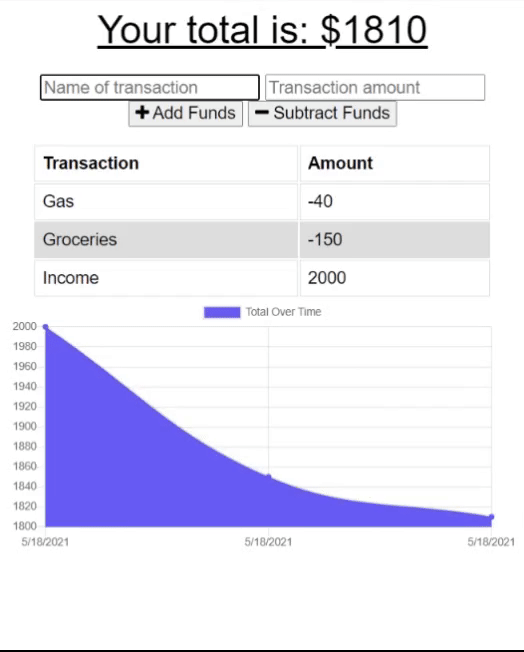

# PWA Budget


## Description
A budget progressive web application that allows a user to log expenses and deposits. When offline, a user is able to enter deposits and expenses which are tracked when the app is bought online. This progressive web application utilizes a serviceWorker, manifest, and indexedDB.

## Table of Contents
* [Links](#links)
* [Animation](#animation) 
* [Instructions](#instructions) 
* [Installation](#installations) 
* [Tests](#tests) 
* [Technologies](#technologies)  
* [License](#license)
* [Contact](#contact)

## Links
Published URL: [https://pwa-budget-log.herokuapp.com/](https://pwa-budget-log.herokuapp.com/)

Repository: [https://github.com/spencercreer/pwa-financial-budget](https://github.com/spencercreer/pwa-financial-budget)


## Animation
The following animation demonstrates the application functionality:


## Instructions
The user may enter a transaction name and amount and click the add or subtract funds buttons. The transaction will be stored to the datase and displayed in the table and chart. The user may add transactions while offline. Transactions entered while offline will be stored to the database once the application is brought online.

## Installation
To install necessary dependencies, run the following command:

  ```
  npm install
  npm i express
  npm i morgan
  npm i mongoose
  npm i compression
  ```
## Tests
To run tests, run the following command:

  ```
  Tests in development
  ```
    
## Contribute
Please submit a PR if you would like to contribute.

## Technologies
 * JavaScript
 * HTML
 * CSS
 * Heroku
 * Express


## License
This project is licensed under the MIT license.

## Contact
For questions or comments, please contact me.

Email: <a href="mailto: spencercreer@gmail.com" target="_blank">spencercreer@gmail.com</a>

GitHub: [spencercreer](https://github.com/spencercreer/)
